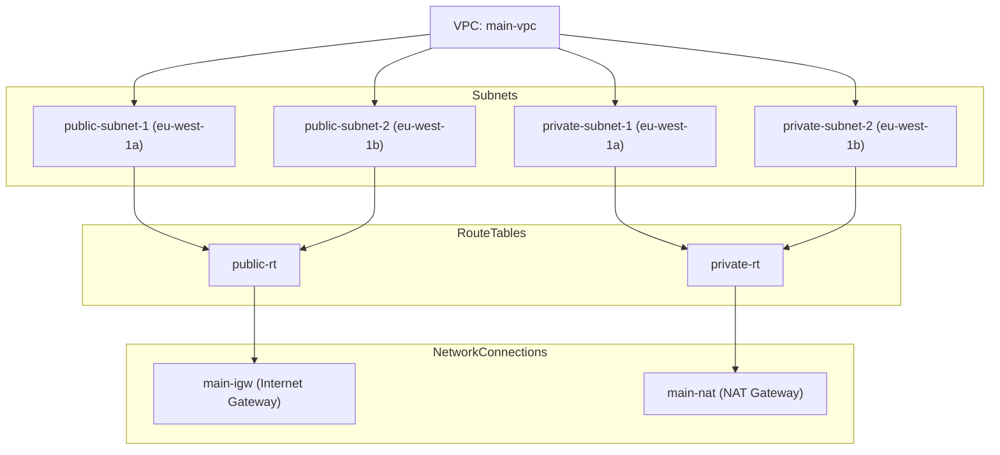

# DevOps Course Tasks

This repository contains Terraform infrastructure tasks for a DevOps course.

## Usage

Run `make` to deploy the infrastructure. The Makefile includes the following targets:

- `format`: Formats Terraform files
- `check`: Checks formatting of Terraform files
- `validate`: Validates Terraform files
- `init`: Initializes Terraform
- `plan`: Creates an execution plan
- `apply`: Applies the Terraform configuration
- `destroy`: Destroys the infrastructure

## CI/CD

GitHub Actions runs on push, PR, and manual triggers:

- Checks formatting
- Plans infrastructure
- Applies to AWS (on main)

## Notes

- State is stored in an S3 bucket
- CI assumes an IAM role via OIDC

## Architecture

The architecture consists of a VPC with two availability zones (AZ1 and AZ2), each containing public and private subnets. The bastion host is in the public subnet of AZ2, while the public VM is in the public subnet of AZ1. The private VMs are in their respective private subnets.


The following diagram illustrates the network connections and routing tables.



The following table lists the VMs created in the infrastructure.

| Name             | Instance ID            | AZ         | Public IP        | Private IP     | Security Group  |
|------------------|------------------------|------------|------------------|----------------|-----------------|
| bastion-host     | i-054a6efc895bb2e65    | eu-west-1a | 34.248.59.113    | 10.0.1.155     | bastion-sg      |
| public-vm        | i-07934d09c5ef6492d    | eu-west-1b | 3.254.135.50     | 10.0.2.48      | public-vm-sg    |
| private-vm-a     | i-01316392d209f28fb    | eu-west-1a | —                | 10.0.101.26    | private-vm-sg   |
| private-vm-b     | i-06deb0195ce41bde2    | eu-west-1b | —                | 10.0.102.55    | private-vm-sg   |

## Connectivity Testing

Each VM has been tested for connectivity as follows.

1. Bastion VM

   ```
   ssh -A ec2-user@34.248.59.113
   [ec2-user@ip-10-0-1-155 ~]$ curl -s ifconfig.me      # Via IGW
   34.248.59.113
   [ec2-user@ip-10-0-1-155 ~]$ ssh ec2-user@10.0.2.48   # Connects to public VM
   [ec2-user@ip-10-0-1-155 ~]$ ssh ec2-user@10.0.101.26 # Connects to private VM A
   [ec2-user@ip-10-0-1-155 ~]$ ssh ec2-user@10.0.102.55 # Connects to private VM B
   ```

2. Public VM

   ```
   ssh -A ec2-user@3.254.135.50
   [ec2-user@ip-10-0-2-82 ~]$ curl -s ifconfig.me       # Via IGW
   3.254.135.50
   [ec2-user@ip-10-0-1-155 ~]$ ssh ec2-user@10.0.101.26 # Does not connect to private    VM A
   [ec2-user@ip-10-0-1-155 ~]$ ssh ec2-user@10.0.102.55 # Does not connect to private    VM B
   ```

3. Private VM A

   ```
   ssh -A ec2-user@34.248.59.113                           # Connects to bastion
   [ec2-user@ip-10-0-1-155 ~]$ ssh -A ec2-user@10.0.101.26 # Connects to private VM A
   [ec2-user@ip-10-0-101-26 ~]$ curl ifconfig.me           # Via NAT
   63.35.144.83
   [ec2-user@ip-10-0-101-26 ~]$ ssh ec2-user@10.0.2.48     # Connects to public VM
   [ec2-user@ip-10-0-101-26 ~]$ ssh ec2-user@10.0.102.55   # Does not connect to    private VM B
   ```

4. Private VM B

   ```
   ssh -A ec2-user@34.248.59.113                           # Connects to bastion
   [ec2-user@ip-10-0-1-155 ~]$ ssh -A ec2-user@10.0.102.55 # Connects to private VM B
   [ec2-user@ip-10-0-101-26 ~]$ curl ifconfig.me           # Via NAT
   63.35.144.83
   [ec2-user@ip-10-0-101-26 ~]$ ssh ec2-user@10.0.2.48     # Connects to public VM
   [ec2-user@ip-10-0-101-26 ~]$ ssh ec2-user@10.0.101.26   # Does not connect to    private VM A
   ```

## K3s Cluster Setup

Install and configure a lightweight Kubernetes (k3s) cluster on AWS EC2 instances provisioned by Terraform.

The following table lists the private and public IP addresses of the EC2 instances:

| Name         | Private IP     | Public IP        |
|--------------|----------------|------------------|
| public-vm    | 10.0.2.175     | 3.250.121.94     |
| bastion-host | 10.0.1.117     | 3.253.17.168     |
| private-vm-a | 10.0.101.123   | None             |
| private-vm-b | 10.0.102.39    | None             |

### Master Node Setup (private-vm-a)

#### 1. SSH from Bastion

```sh
ssh -A ubuntu@3.253.17.168
ssh ubuntu@10.0.101.123
```

#### 2. Install k3s Server

```sh
curl -sfL https://get.k3s.io | sh -
```

#### 3. Get Cluster Token

```sh
sudo cat /var/lib/rancher/k3s/server/node-token
```

#### 4. Verify Node

```sh
sudo k3s kubectl get nodes
```

You should see output similar to:

```
ubuntu@ip-10-0-101-123:~$ sudo k3s kubectl get nodes
NAME              STATUS   ROLES                  AGE   VERSION
ip-10-0-101-123   Ready    control-plane,master   1m    v1.32.5+k3s1
```

### Worker Node Setup (private-vm-b)

#### 1. SSH from Bastion

```sh
ssh ubuntu@10.0.102.39
```

#### 2. Install k3s Agent

```sh
curl -sfL https://get.k3s.io | K3S_URL=https://10.0.101.123:6443 K3S_TOKEN=<token> sh -
```

Replace `<token>` with the value from the master node.

### Bastion Host Setup

##### 1. SSH into the Bastion Host

```sh
ssh -A ubuntu@3.253.17.168
```

#### 2. Install `kubectl`

```sh
curl -LO "https://dl.k8s.io/release/$(curl -sL https://dl.k8s.io/release/stable.txt)/bin/linux/amd64/kubectl"
chmod +x kubectl
sudo mv kubectl /usr/local/bin/
```

#### 3. Copy the Kubeconfig to the Bastion Host

The file is located at `/etc/rancher/k3s/k3s.yaml` on the master node.

#### 4. Update the Kubeconfig

```sh
sed -i 's/127.0.0.1/10.0.101.123/' ~/k3s.yaml
```

#### 5. Verify `kubectl` Configuration

```sh
export KUBECONFIG=~/k3s.yaml
kubectl get nodes
```

You should see output similar to:

```
NAME              STATUS   ROLES                  AGE   VERSION
ip-10-0-101-123   Ready    control-plane,master   2m    v1.32.5+k3s1
ip-10-0-102-39    Ready    worker                 1m    v1.32.5+k3s1
```

### Access from Local Machine

To access the k3s cluster from your local machine, you need to set up an SSH tunnel.

#### 1. Start SSH Tunnel

```sh
ssh -i bastion_ssh_key.pem -L 6443:10.0.101.123:6443 ubuntu@3.253.17.168
```

#### 2. Copy Kubeconfig

```sh
scp -i bastion_ssh_key.pem ubuntu@3.253.17.168:/home/ubuntu/k3s.yaml ~/.kube/config
```

#### 3. Update and Use Kubeconfig

Edit `~/.kube/config`:

```yaml
server: https://localhost:6443
```

Then run:

```sh
kubectl get nodes
kubectl get pods
```
