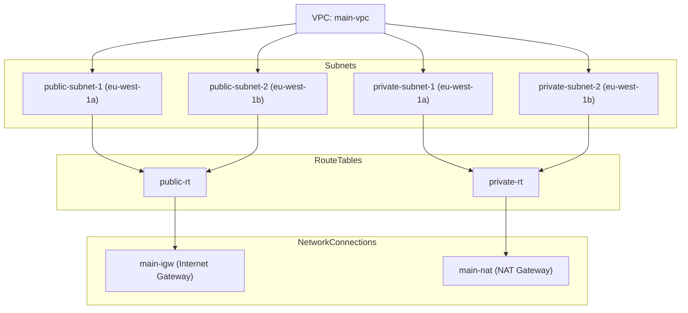

# DevOps Course Tasks

This repository contains Terraform infrastructure tasks for a DevOps course.

## Architecture

The architecture consists of a VPC with two availability zones (AZ1 and AZ2), each containing public and private subnets. The bastion host is in the public subnet of AZ2, while the public VM is in the public subnet of AZ1. The private VMs are in their respective private subnets.


The following diagram illustrates the network connections and routing tables.



The following table lists the VMs created in the infrastructure.

| Name             | Instance ID            | AZ         | Public IP        | Private IP     | Security Group  |
|------------------|------------------------|------------|------------------|----------------|-----------------|
| bastion-host     | i-054a6efc895bb2e65    | eu-west-1a | 34.248.59.113    | 10.0.1.155     | bastion-sg      |
| public-vm        | i-07934d09c5ef6492d    | eu-west-1b | 3.254.135.50     | 10.0.2.48      | public-vm-sg    |
| private-vm-a     | i-01316392d209f28fb    | eu-west-1a | —                | 10.0.101.26    | private-vm-sg   |
| private-vm-b     | i-06deb0195ce41bde2    | eu-west-1b | —                | 10.0.102.55    | private-vm-sg   |

## Tests

Each VM has been tested for connectivity as follows.

1. Bastion VM

```
ssh -A ec2-user@34.248.59.113
[ec2-user@ip-10-0-1-155 ~]$ curl -s ifconfig.me      # Via IGW
34.248.59.113
[ec2-user@ip-10-0-1-155 ~]$ ssh ec2-user@10.0.2.48   # Connects to public VM
[ec2-user@ip-10-0-1-155 ~]$ ssh ec2-user@10.0.101.26 # Connects to private VM A
[ec2-user@ip-10-0-1-155 ~]$ ssh ec2-user@10.0.102.55 # Connects to private VM B
```

2. Public VM

```
ssh -A ec2-user@3.254.135.50
[ec2-user@ip-10-0-2-82 ~]$ curl -s ifconfig.me       # Via IGW
3.254.135.50
[ec2-user@ip-10-0-1-155 ~]$ ssh ec2-user@10.0.101.26 # Does not connect to private VM A
[ec2-user@ip-10-0-1-155 ~]$ ssh ec2-user@10.0.102.55 # Does not connect to private VM B
```

3. Private VM A

```
ssh -A ec2-user@34.248.59.113                           # Connects to bastion
[ec2-user@ip-10-0-1-155 ~]$ ssh -A ec2-user@10.0.101.26 # Connects to private VM A
[ec2-user@ip-10-0-101-26 ~]$ curl ifconfig.me           # Via NAT
63.35.144.83
[ec2-user@ip-10-0-101-26 ~]$ ssh ec2-user@10.0.2.48     # Connects to public VM
[ec2-user@ip-10-0-101-26 ~]$ ssh ec2-user@10.0.102.55   # Does not connect to private VM B
```

4. Private VM B

```
ssh -A ec2-user@34.248.59.113                           # Connects to bastion
[ec2-user@ip-10-0-1-155 ~]$ ssh -A ec2-user@10.0.102.55 # Connects to private VM B
[ec2-user@ip-10-0-101-26 ~]$ curl ifconfig.me           # Via NAT
63.35.144.83
[ec2-user@ip-10-0-101-26 ~]$ ssh ec2-user@10.0.2.48     # Connects to public VM
[ec2-user@ip-10-0-101-26 ~]$ ssh ec2-user@10.0.101.26   # Does not connect to private VM A
```

## Usage

Run `make` to deploy the infrastructure. The Makefile includes the following targets:

- `format`: Formats Terraform files
- `check`: Checks formatting of Terraform files
- `validate`: Validates Terraform files
- `init`: Initializes Terraform
- `plan`: Creates an execution plan
- `apply`: Applies the Terraform configuration
- `destroy`: Destroys the infrastructure

## CI/CD

GitHub Actions runs on push, PR, and manual triggers:

- Checks formatting
- Plans infrastructure
- Applies to AWS (on main)

## Notes

- State is stored in an S3 bucket
- CI assumes an IAM role via OIDC
